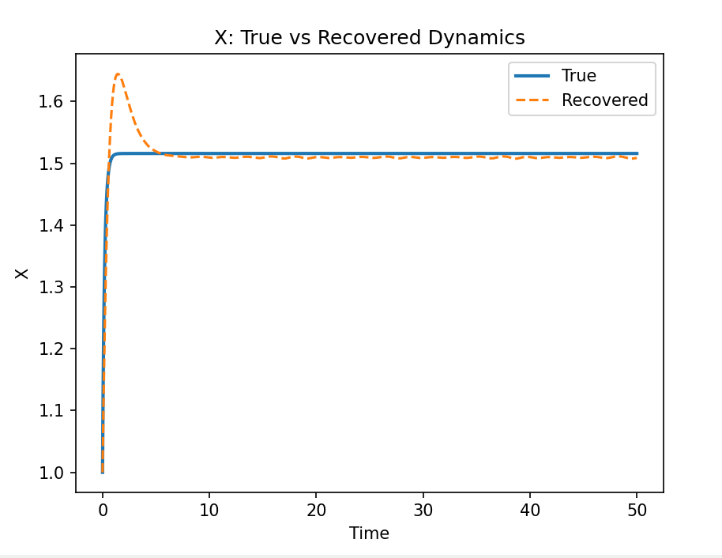

# Symbolic Regression for Biological ODE Discovery

This project benchmarks **symbolic regression methods** on **ground-truth biological dynamical systems** defined using SBML.  
The goal is to evaluate when symbolic regression can recover governing equations of biological networks and when it fails, and to understand these outcomes through **dynamical validation** rather than symbolic similarity alone.

The work is motivated by hybrid approaches such as **CellBox**, which combine mechanistic modeling with machine learning to improve interpretability and robustness.

---

## Project Pipeline

1. Start from curated **SBML-based biological ODE models**
2. Simulate time-series data using numerical ODE solvers
3. Add biologically realistic noise
4. Estimate time derivatives from observed trajectories
5. Apply symbolic regression to rediscover governing equations
6. Compare recovered models against ground truth at the **dynamical level**

---

## Example Model: Repressilator

The repressilator is a classic gene regulatory network with nonlinear Hill-type repression dynamics.  
It serves as a challenging benchmark due to:
- Strong nonlinearity
- Oscillatory behavior
- Identifiability issues under limited observations

---

## Results: True vs Recovered Dynamics (X)

> **Key finding:**  
> *Although symbolic regression did not recover the true Hill-function structure, the recovered equations accurately reproduced the steady-state and stability properties of the system, underscoring the importance of dynamical validation and motivating biologically constrained hybrid models.*

---

## Important Observations

- Symbolic regression recovered **low-complexity equations** that fit observed derivatives well, but did not recover the original Hill-type repression terms.
- Nonlinear biological rate laws were approximated using simpler polynomial interaction terms, reflecting limitations of the symbolic operator set.
- Despite symbolic mismatch, the recovered system reproduced the **correct steady-state behavior** of the true biological model.
- Minor discrepancies were observed during early transient dynamics, while long-term stability was preserved.
- This demonstrates that **dynamical equivalence** can be achieved even when mechanistic identifiability fails.
- These results highlight the need for **biological priors and structural constraints**, as used in hybrid approaches like CellBox.

---

## Key Takeaway

Symbolic regression alone can capture system-level behavior but struggles to recover true biological mechanisms in the presence of nonlinear kinetics and correlated variables.  
Evaluating models based solely on symbolic similarity is insufficient; **dynamical validation is essential** for biological relevance.

---

## Motivation for Hybrid Models

The observed failure modes motivate:
- Incorporating known interaction graphs
- Enforcing sparsity and biological constraints
- Optimizing for dynamical behavior rather than symbolic exactness

These ideas align directly with **CellBox-style hybrid mathematical–machine learning models** for predicting cell network dynamics.

---

## Future Work

- Expand operator sets to better capture Hill-type kinetics
- Study partial observability and hidden variables
- Introduce biological priors into symbolic regression
- Compare against hybrid neural–mechanistic models

---

## Author

Vinayak Toor  (vinayaktoor AT gmail.com)
